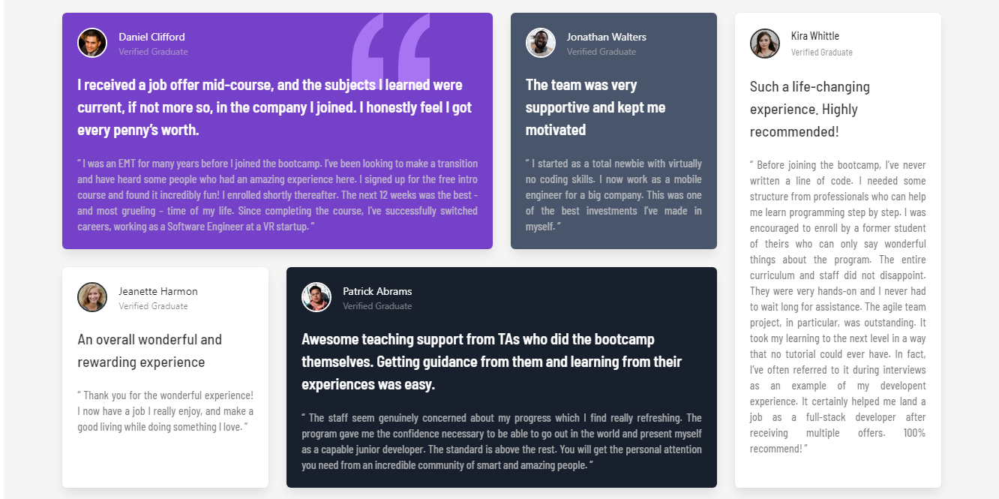

# Frontend Mentor - Testimonials grid section



## About

This is a project for Frontend Mentor.

I used Bulma Framework ([Bulma.io](https://bulma.io)) to make the grid, It was a good opportunity to learn more about the tile element and its usability. This challenge allowed me to finish my studies on Bulma Framework, it was a lot of fun to do it. 

The result of the work is identical to the proposed challenge. After finishing, I took the liberty of making some small improvements to the project, which is eye-catching and 100% responsive.

[Frontend Mentor](https://www.frontendmentor.io) challenges allow you to improve your skills in a real-life workflow.

## Run

To run this project just clone this repository and run the ```index.html``` file.